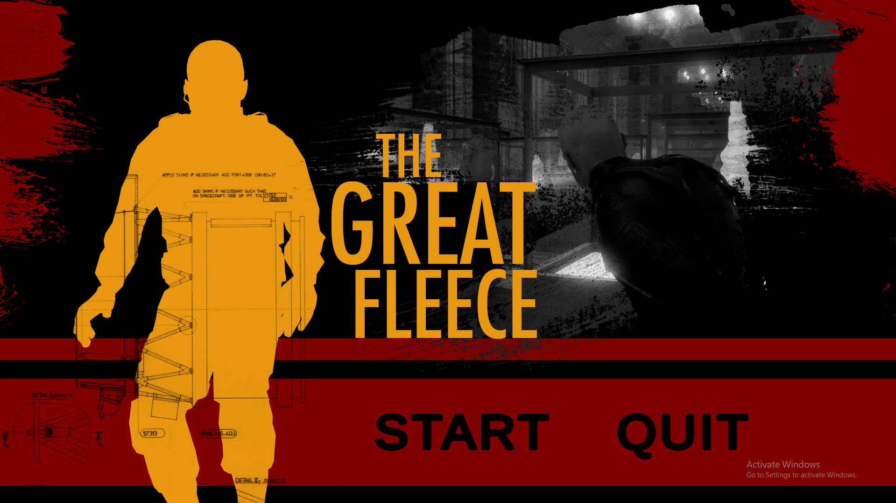
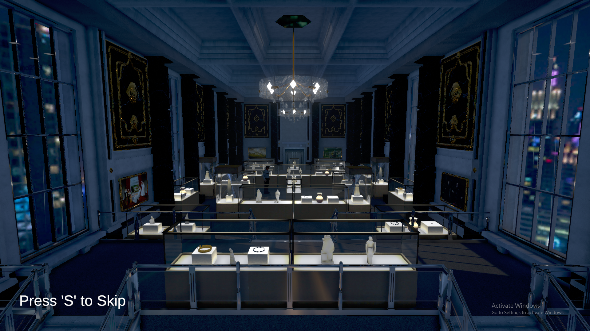

# 🎮 The Great Fleece (Unity Course Project)

> 🚧 This project was developed as part of a Unity game development course to learn key game programming concepts and cinematic tools.

---

## 📘 About the Project

**The Great Fleece** is a stealth-based 3D game built using Unity. It features timeline-driven cutscenes, interactive gameplay, enemy AI, and fade-to-black transitions.

I worked on this project while following a professional Unity course. During this, I implemented and customized core gameplay features, UI elements, and cutscene logic.

---

## 🛠️ Technologies Used

- Unity (Editor version: **6000.0.34f1**)
- C# for scripting
- Timeline and PlayableDirector for cutscenes
- Cinemachine for camera control
- Unity UI System
- Animator + coroutines
- Event-driven scripting (`PlayableDirector.stopped`, triggers, etc.)

---

## 🧠 What I Learned

- Cutscene setup and timeline triggering using `PlayableDirector`
- Cinemachine camera switching and transitions
- Creating skippable intros with logic
- Guard AI basics and stealth interactions
- UI elements with transitions and fade overlays
- GameManager singletons and cross-scene logic
- Handling post-cutscene camera resets and player enabling

---

## 🎮 How to Play (Windows Build)

- **Left Click**: Move player to a point (point & click)
- **Right Click**: Throw a coin for distraction
- **S**: Skip the intro cutscene

**Goal**: Avoid guards and reach the objective without getting caught.

---

## 📸 Screenshots

